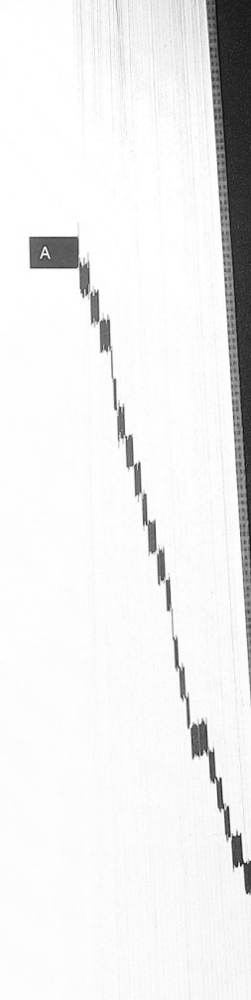

就是～的优良传统。” 注：～，汉阿组合，“阿”汉语某些称谓（昵称）的前缀，“斯”阿拉伯语“穆斯林”的汉语简化，“斯”字在此读作去声。

【阿斯茫★】ā sī máng（a $ ^{53} $si $ ^{21} $mang $ ^{24} $）[a $ ^{53} $s $ ^{21} $man $ ^{24} $]阿拉伯、波斯语 ىسماء天空。例：“今个黑咧（今天晚上），～上的星星咋这么的亮？”“你看，～上有一架飞机”“～上乌云翻滚呢，好像要下雨呢！”

【阿嫂】ā sǎo（a²¹ sao²¹）[a²¹ sau⁴⁴] 称丈夫的嫂子。例：“这位是我~。”“那个小个子女人是她的二～。”“他三个哥都结了婚，他就有三个～。” 注：汉族背称，而回族当面对人可以称谓。

【阿塌儿说,阿塌儿撂】ā tǎ ér shuō, ā tǎ ér liào (a $ ^{21} $ter $ ^{21} $she $ ^{21} $.a $ ^{21} $ter $ ^{21} $liao $ ^{44} $) [a $ ^{21} $.th $ ^{21} $er s $ ^{21} $a $ ^{21} $.th $ ^{21} $er liau $ ^{44} $]为了避免是非，说过的话只能放在心里，不能再提起，不能对外宣扬。例：“今天的话咱俩人～，装在心里，不许对旁人再说！” “有句话～，我说得对你就考虑，说的不对，就当我没说，好吧？”

【阿塌儿】ǎ tar（a²⁻²tar²⁻²]）[a²⁻².t²⁻²]哪里。例：“你连你自己在～死都不知道，可给别人算命呢！”“大嫂大赶早你到～去呀？”“你把乃本书放在～咧，我就是找不见！”

注：“阿”字是“哪”的音变字，是“哪”减去声母n的结果。近代汉语有“那塌儿”一词是“哪里”的意思。元代杂剧《潇湘夜雨》第二回：“但不知那（哪）塌儿里把我磨勒死！”

【阿瓦子★】ǎ wǎ zǐ（a $ ^{53} $va $ ^{21} $zǐ $ ^{21} $）[a $ ^{53} $va $ ^{21} $ts $ ^{21} $]波斯语：او！，话语。例：“常言道，言多必失，你的～咋那么多？往后少说话！”“让他～减条（少说），不要说话！”“他的～太多咧，人听着觉得啰嗦。” 注：～，波斯语中有“歌声、歌唱”的含义，回族由于信仰一般比较轻视歌唱，因而该～当做“说话”使用时，略含有警告，鄙视的语气，如：“你立即停止你的～，你的～有伤害他人之嫌疑！”“你的～太繁（多），不要再说咧！”

【阿耶提★】ǎ yē tí（a $ ^{53} $yē $ ^{53} $ti $ ^{21} $）[a $ ^{53} $i $ e^{44} $t $ ^{1} $i $ ^{21} $]阿拉伯语 أبو，《古兰经》中的章节经文，真主的明证、迹象。例：“今天我给大家诵读一段～，大家共同学习。”“禁止饮酒是《古兰经》里～的明文禁戒命令，穆斯林必须遵从。”

【阿杂】ā zā (a²¹za²¹) [a²¹tāa²¹]忧愁。例：“他正为这些为难事～得很呢！”“你不要～，你光（只）～也解决不了问题。”

【阿杂脸★】ā zā liǎn (a²¹za²¹liàn⁵³) [a²¹tsa²¹liā⁵³]愁容满面，脸色愁云的人。

例：“你遇事不要～，～大家看着都不痛快。”“你看乃个（那个）～来了，大家不要说这些惹人不高兴地话。”

【阿里】ā lǐ（a $ ^{21} $lì $ ^{21-53} $）[a $ ^{21} $lì $ ^{21-53} $]疑问代词，哪里、哪儿。例：“只听见声音，不见人，你到底到在～？”“这半天不见你，你到底去了～？”“大哥你急急火火到~去呀？”注：～也做“阿呢”，哪里、哪儿的意思。例：“你老先生～来的火气（怒气）发到我这里了？”“你这香蕉是在～买的？”

【啊是的】ā shì de（a $ ^{21} $si $ ^{21} $di $ ^{0} $）[a $ ^{21} $si $ ^{21} $ti] 疑问句，那是的。例：“你说书在桌子上，～？没有麽！”“你说他在房里呢，～？” 注：“阿”当“哪”用，即：哪是？～一般用在反问句里。“是”读阴平。

【哪一个】ā yí gè（a yī gè $ ^{44} $）[a $ ^{53} $i $ ^{21} $kʰ $ ^{44} $] 谁，哪一个、哪个。例：“你是～？”“当初没有他出来说话，你们～是牛牛娃敢出来说一句话？”“面对高手挑战，他们～敢出来应战？” 注：西安回族一般在言语中不用“哪一个”“哪个”来询问，而用“阿”替代“哪”。例：“刚才是～从这儿经过？”“这么多的玩具你究竟要～？”“你们～不同意就举手。”

【换（捱）】ái（eai $ ^{24} $）[næ $ ^{24} $] 遭受、经受。例“他怫打架，老土路过时头上糊里糊涂~了一棍。”“他从小~他妈的打，~怕了，他妈一声喊娃浑身打颤。”“他~了一顿诀（骂）。”“他今天~骂又~打咧。”“他没有眼色，每天都要~领导的批评。” 注：该词语常常作为前缀和后面的词连接在一起，表示经受了某种行为，如：~打、~骂、~批评、~头子、~戳。“挨”字声母不同西安汉族，汉族发[n]声母，读[næ $ ^{24} $]，回族发[ŋ]读[ŋæ $ ^{24} $]。这也是西安回汉语音的显著区别的一个音节。

【挨不起】ái bù qǐ（eai $ ^{24} $bu $ ^{21} $qiē $ ^{53} $）[næ $ ^{24} $pu $ ^{21} $kì $ ^{53} $]经不起事、经受不住。例：“给人家一句话，好汉子不要那样做～的事情。”“会打人，自己～打不行啊，要能挨起打才能成。”“你～就不要和旁人开玩笑，爱和别人开玩笑就不要～，肉只需你笑话别人，不许别人拿你开玩笑！”注：元、明词语也为“挨不起”。《西游记》21回：“你外公手儿重重的只怕你～这一棒啊。”“起”读如“且”[kì $ ^{53} $]。

【挨挫】āi cuò（eai $ ^{24} $cuò $ ^{21} $）[næ $ ^{24} $pf $ ^{h} $u $ ^{21} $] 经受打击、挫折。例：“这就不是你说话的时间嘛！你这不是寻着～呢？”“他在外头～咧，才知道回头。”

